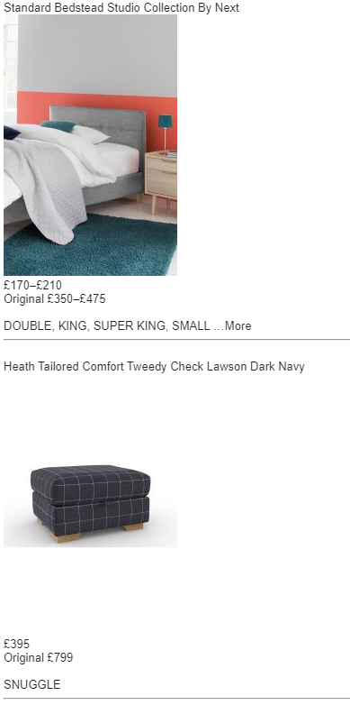

Next clearance Scraper
===

## What this does

A python script to periodically scrape Next's clearance store's items using selenium and email them to you. The items found are cached locally, and any newly found items are sent to the specified email address(es). An example is shown here:




## Picking the product types

The items in the clearance list are not categorised by type, so to choose something, you need to have a look at the results page, and check to see what patterns you see in the text. The best strategy I've found is to pick a list of strings used for sizes. Included is code to select sofas.


## Running the script

The python script is executed using python (version 3.6+), and the following possible command line arguments:

|  Argument | Required | What it is | Default value |
|:-------------:| :-----:| :-----:| :---: |
| --u  | Yes  | The sender email address *  | - |
| --p | Yes | The password for the sender email address  |  |
| --t  | No  | The interval time, in minutes, for scraping | 60 |
| --to  | Yes  | Comma separated list of recipiend email addresses to receive the scraped items | - |


* If you are using a gmail address, you may need to go to settings and allow "less secure apps" to use it. (https://support.google.com/accounts/answer/6010255?hl=en)


Example:

```python scrape.py --u=me@email.com --p=password --t=5 --to=also_me@email.com```

This will scrape the items matching the pattern in the code and send it to the also_me@email.com email address, from the me@email.com email address, every 5 minutes.


